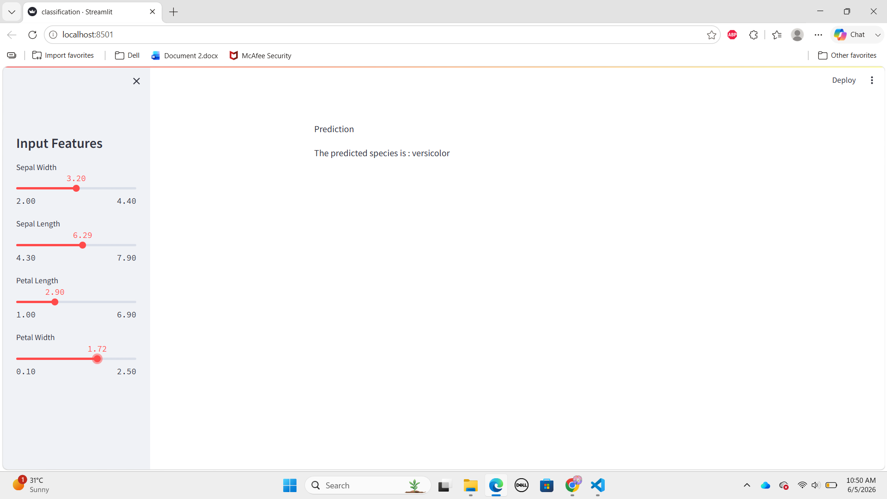

# Iris Flower Classification 🌸

A Machine Learning web application that predicts the species of an Iris flower using the Random Forest Classification algorithm and Streamlit.

## Features

* Interactive Streamlit interface
* Real-time predictions
* Random Forest Classifier
* Built using the Iris Dataset
* User-friendly sliders for flower measurements

## Technologies Used

* Python
* Streamlit
* Pandas
* Scikit-Learn

## Dataset Features

* Sepal Length
* Sepal Width
* Petal Length
* Petal Width

## Predicted Classes

* Iris Setosa
* Iris Versicolor
* Iris Virginica

## Installation

```bash
pip install -r requirements.txt
```

## Run the Application

```bash
streamlit run classification.py
```

## Application Preview



## Author

Mahnoor Khalid

